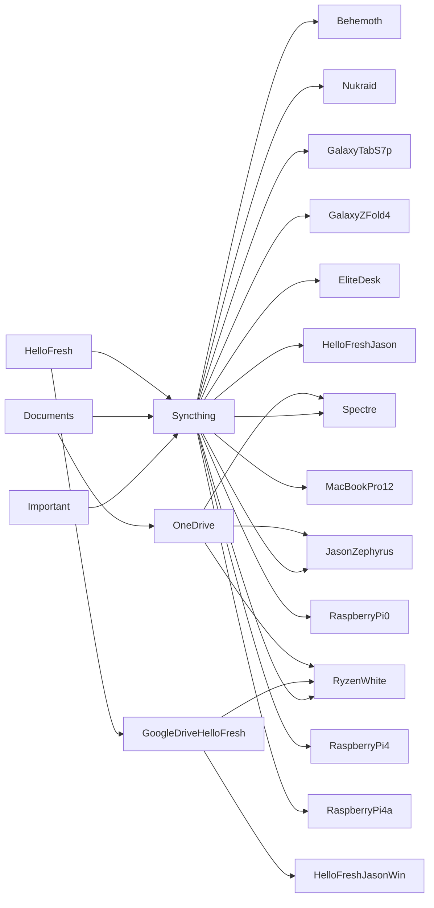
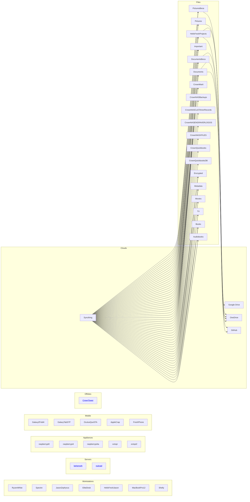

# Devices

## File Services Mermaid

```mermaid
graph LR;

%% Asset Root to Cloud
Important --> Syncthing
Documents --> Syncthing
Documents --> OneDrive
HelloFresh --> Syncthing
HelloFresh --> GoogleDriveHelloFresh

%% Syncthing to Hostname
Syncthing --> Behemoth
Syncthing --> Nukraid
Syncthing --> RyzenWhite
Syncthing --> Spectre
Syncthing --> JasonZephyrus
Syncthing --> GalaxyTabS7p
Syncthing --> GalaxyZFold4
Syncthing --> EliteDesk
Syncthing --> HelloFreshJason
Syncthing --> MacBookPro12
Syncthing --> RaspberryPi0
Syncthing --> RaspberryPi4
Syncthing --> RaspberryPi4a

%% GoogleDrive HelloFresh to Hostname
GoogleDriveHelloFresh --> HelloFreshJasonWin
GoogleDriveHelloFresh --> RyzenWhite

%% OneDrive to Hostname
OneDrive --> RyzenWhite
OneDrive --> Spectre
OneDrive --> JasonZephyrus

```

## System Services Mermaid

```mermaid
graph LR;

  subgraph "Workstations"
    WB[RyzenWhite]
    WC[Spectre]
    WD[JasonZephyrus]
    WE[EliteDesk]
    WF[HelloFreshJason]
    WG[MacBookPro12]
    WH[Shelly]
  end
  
  subgraph "Servers"
    SB[<a href='http://behemoth.local/'>behemoth</a>]
    SC[<a href='http://nukraid.local/'>nukraid</a>]
  end
  
  subgraph "Appliances"
    AB[raspberrypi0]
    AC[raspberrypi4]
    AD[raspberrypi4a]
    AE[octopi]
    AF[octopi2]
  end
  
  subgraph "Mobile"
    MB[GalaxyZFold4]
    MC[GalaxyTabS7P]
    MD[OculusQueSTA]
    ME[AppleCrap]
    MG[FreshPhone]
  end
  
  subgraph "Files"
    FA[Documents]
    FB[DocumentsBeca]
    FC[HelloFreshProjects]
    FD[Important]
    FE[Pictures]
    FF[PicturesBeca]
    FG[CrownMarti]
    FH[CrownNASBackups]
    FI[CrownNASCuSTAmerRecords]
    FJ[CrownNASENGRAVERLOGOS]
    FK[CrownNASXFILES]
    FL[CrownQuickbooks]
    FM[CrownQuickbooksDB]
    FN[Encrypted]
    FO[Metadata]
    FP[Movies]
    FQ[TV]
    FR[Books]
    FS[Audiobooks]
  end
  
  subgraph "Offsites"
    OA[<a href='http://CrownTower.local/'>CrownTower</a>]
  end
  
  subgraph "Clouds"
    CA[Google Drive]
    CB[OneDrive]
    CD[GitHub]
    STA[Syncthing]
  end
  
  %% RyzenWhite Syncthing
  STA --> FA
  STA --> FB
  STA --> FC
  STA --> FD
  STA --> FE
  
  %% RaspberryPi0 Syncthing
  STA --> FA
  
  %% RaspberryPi4 Syncthing
  STA --> FA
  
  %% RaspberryPi4a Syncthing
  STA --> FA
  
  %% behemoth Syncthing
  STA --> FA
  STA --> FB
  STA --> FD
  STA --> FE
  STA --> FF
  STA --> FG
  STA --> FH
  STA --> FI
  STA --> FJ
  STA --> FK
  STA --> FL
  STA --> FM
  STA --> FN
  STA --> FO
  STA --> FP
  STA --> FQ
  STA --> FR
  STA --> FS
  
  %% nukraid Syncthing
  STA --> FA
  STA --> FB
  STA --> FD
  STA --> FE
  STA --> FF
  STA --> FN
  STA --> FO
  STA --> FP
  STA --> FQ
  STA --> FR
  STA --> FS
  
  %% Spectre Syncthing
  STA --> FA
  STA --> FC
  STA --> FD
  
  %% JasonZephyrus Syncthing
  STA --> FA
  STA --> FC
  STA --> FD
  
  %% EliteDesk Syncthing
  STA --> FC
  
  %% HelloFreshJason Syncthing
  STA --> FC
  
  %% GalaxyZFold4 Syncthing
  STA --> FA
  STA --> FD
  STA --> FR
  STA --> FN
  STA --> FO
  
  %% GalaxyTab7P Syncthing
  STA --> FA
  STA --> FD
  STA --> FR
  STA --> FN
  STA --> FO
  
  %% Shelly Syncthing
  STA --> FB
  STA --> FF
  
  %% Cloud Syncs
  FA --> CB
  FA --> CD
  FB --> CB
  FE --> CB
  FF --> CB
  FC --> CA
  FC --> CD
  
  
  
```
