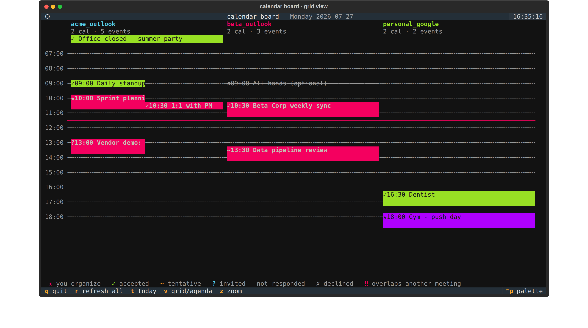
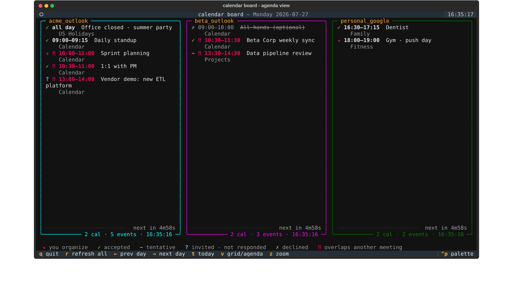

# Calendar board — side-by-side calendars TUI

`src/calendar_board.py` is a long-lived Textual TUI that shows every
configured calendar account — Google Calendar and Outlook on the web
(Microsoft Graph) — **side by side for one day at a time**, so overlapping
meetings between clients are visible at a glance. It covers **all** of each
account's calendars (secondary and subscribed ones included), and every
event is badged with your attendance state, so what you merely got invited
to never blends in with what you actually accepted.

The default view is a Google-Calendar-style **time grid**: a shared vertical
time axis, one column per account, events drawn as colored blocks positioned
and sized by their times — a cross-client double booking is two blocks at
the same height before the `‼` flag even registers. Overlapping events
within one account split into side-by-side sub-lanes, all-day events sit in
a banner row above the axis, and a red rule marks the current time on
today's grid.


*(demo data — two client Outlook accounts and a personal Google account;
red blocks are cross-source overlaps, the strikethrough event is declined)*

`v` flips to the **agenda view** — the same day as compact per-account
lists, better when titles matter more than geometry:



It is deliberately a **separate TUI from the status board**, not a tab inside
it: each board refreshes on its own cadence without redrawing the other, and
tmux panes/windows already do the side-by-side or tabbing better than one
merged app would (see [setup_status_board.md](./setup_status_board.md) for the
same viewing-over-ssh tricks — both boards render fine from Blink/Termius).

```bash
cd ~/GitHub/dotfiles
uv sync
uv run python src/calendar_board.py                       # the live board
uv run python src/calendar_board.py --once --days 3       # static print, no TUI
uv run python src/calendar_board.py --once --grid         # static print of the time grid
uv run python src/calendar_board.py --auth acme_outlook   # one-time token minting (below)
```

Keys: `←`/`→` previous/next day · `t` today · `v` grid/agenda ·
`z` zoom the grid's rows (30 → 15 → 60 minutes) · `r` refresh all · `q` quit.

Each agenda row (and each grid block's label) shows a badge, the local time
range, and the title; the agenda also names (dimmed) which of the account's
calendars the event lives on:

- `★` you are the organizer
- `✓` accepted
- `~` tentative
- `?` **invited, not responded** — the ones that need an answer
- `✗` declined (dimmed and struck through; never counts as a conflict)
- `‼` **overlap** — this meeting collides with another non-declined meeting
  in ANY column, so a client-A/client-B double booking lights up on both
  sides. All-day events don't count as collisions.

Day navigation is instant from cache: each source fetches a rolling ~2-week
window around the viewed day and only refetches when you navigate outside it
(or its refresh interval fires).

## Where sources come from

Same overlay pattern as the status board. On startup the board loads, in
order:

1. `calendarboard.yaml` in this repo's root, if present — tracked in the
   public repo, so **secrets-free sources only**;
2. `<context>_calendarboard.yaml` in every sibling `*_credentials` repo
   (e.g. `acme_credentials/acme_calendarboard.yaml`).

A machine only shows the calendars of the credentials repos it has cloned.
Source names must be unique across all loaded configs. Two or three sources =
two or three columns, which is the intended width.

## Source types

Every source takes `name`, `type`, optional `interval` (seconds between
refreshes, default 300), optional `calendars` (list of calendar names/ids to
show; **omit to show every calendar the account has** — the special token
`primary` matches the account's default calendar), optional `color` (a border
color to tell columns apart faster), and optional `env_file` (relative to the
config's repo) that secrets resolve from. As with the status board, tokens
resolve from the real environment first, then the `env_file` — credentials
never go in the calendarboard config itself.

### `google_calendar`

```yaml
- name: personal_google
  type: google_calendar
  client_id_env: PERSONAL_GOOGLE_CLIENT_ID
  client_secret_env: PERSONAL_GOOGLE_CLIENT_SECRET
  refresh_token_env: PERSONAL_GOOGLE_CALENDAR_REFRESH_TOKEN
  env_file: personal.env
  color: green
```

One-time setup per Google account:

1. In [Google Cloud Console](https://console.cloud.google.com/) create (or
   reuse) a project, enable the **Google Calendar API**, and create an OAuth
   client of type **Desktop app**. Put its client id and secret in the
   credentials repo's env file under the two `*_env` names.
2. If the project's OAuth consent screen is in *Testing* mode, add the
   account as a test user (refresh tokens for test users expire after 7
   days — publish the app to make them long-lived; an internal/personal app
   needs no verification).
3. Run `uv run python src/calendar_board.py --auth personal_google` **on a
   machine with a browser** (the flow catches the redirect on localhost —
   Google's device flow doesn't allow the Calendar scope), approve the
   read-only calendar scope, and paste the printed refresh-token line into
   the env file.

The board only ever requests `calendar.readonly`.

### `outlook_calendar` — Outlook on the web, via Microsoft Graph

```yaml
- name: acme_outlook
  type: outlook_calendar
  client_id_env: ACME_MS_CLIENT_ID
  refresh_token_env: ACME_MS_CALENDAR_REFRESH_TOKEN
  tenant: organizations      # optional; default "common". Use the tenant id if the org restricts it
  env_file: acme.env
  color: cyan
```

Microsoft Graph is the API behind outlook.office.com, so the board shows
exactly what Outlook on the web shows. One-time setup per account:

1. In [Entra admin center](https://entra.microsoft.com/) → App registrations,
   register an app (single tenant is fine for one employer; *personal +
   work accounts* if it should serve outlook.com too). No redirect URI
   needed, but **enable "Allow public client flows"** (Authentication blade)
   — that is what lets the device-code flow work without a client secret.
2. API permissions → Microsoft Graph → **Delegated** → `Calendars.Read` and
   `offline_access`. Client-locked-down tenants may need an admin to grant
   consent.
3. Put the app's client id in the env file, then run
   `uv run python src/calendar_board.py --auth acme_outlook` — the
   device-code flow prints a URL + code, so the browser can be on **any**
   device (works over ssh). Paste the printed refresh-token line into the
   env file.

A confidential client (with a secret) also works: add `client_secret_env:` to
the source and the secret is sent on token refresh. Note Microsoft refresh
tokens expire after ~90 days **of disuse**; a board that runs even
occasionally rolls them forward forever, and if one does lapse the column
says so and `--auth` re-mints it.

## Running next to the status board

Two independent TUIs, composed with tmux however the day demands:

```bash
tmux new-session -s boards 'uv run python src/status_board.py' \; \
     split-window -h 'uv run python src/calendar_board.py' \; \
     select-layout even-horizontal
```

or as separate tmux windows (`c` / `n` to flip), or two terminal tabs — the
calendar board never causes the status board to redraw, and vice versa.
