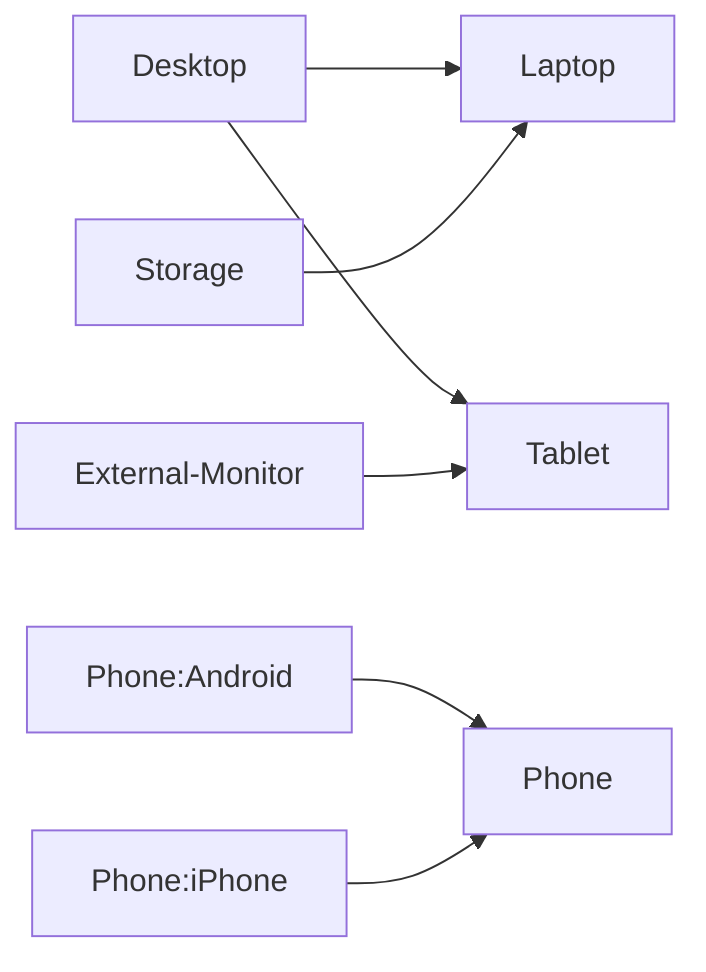

# Crafting a Unified Device Ecosystem: The Agnostic Approach

## Unifying and Streamlining My Digital Experience

In the realm of ever-evolving technology, the hassle of switching between multiple devices with sync issues has inspired me to embark on a journey towards crafting a seamless and unified digital environment. My goal is to replace or consolidate various devices, peripherals, and interfaces to create a cohesive and user-friendly setup.

## Devices for Unification

### Compute Devices

- **Laptop:** A versatile machine for day-to-day tasks.
- **Desktop:** For intensive computing and extended work.
- **Tablet:** Combining portability with functionality.
- **Phone:** A pocket-sized powerhouse for connectivity.
- **Storage:** Centralized data storage for all devices.

### Peripherals

- **Keyboard:** A full-sized keyboard for comfortable typing.
- **Mouse:** Precision control for various tasks.
- **Monitor:** A large display for enhanced visual experience.
- **Speakers:** High-quality audio output.
- **Headphones / Microphone:** Audio communication without compromise.

### Interfaces

- **Networking:** Seamlessly connect all devices.
- **Power Supply:** A standardized power solution.
- **Battery:** Portable power for on-the-go use.
- **Solar:** Harnessing renewable energy.

## Simplifying the Landscape: Visualizing the Transition

## Key Hardware Considerations

### Laptop and Phone Integration

- **Laptop:** My central hub, housing both Windows and WSL to cater to different tasks.
  - Multiple displays for enhanced productivity.
  - Robust connectivity through USB4 or Thunderbolt.
  - Efficient 100w USB-C PD input for simplified charging.
- **Phone:** Integrated with the system, running Android for mobile needs.

## Achieving Device Agnosticism

To achieve a harmonious experience, several factors must align:

- **dotfiles Sync:** A paramount requirement for perfect synchronization across devices.
- **Software Consistency:** Ensuring identical software setup on each operating system.

## Crafting a Mini Portable Rack Setup

- **Networking:** A robust networking infrastructure to interconnect devices seamlessly.
- **PDU (Power Distribution Unit):** Managing power distribution efficiently.
- **UPS (Uninterruptible Power Supply):** Ensuring continuous operation even during power disruptions.

This vision encompasses my desire for a unified digital ecosystem that eliminates the complexities of device-switching and sync challenges. By focusing on integration, synchronization, and hardware synergy, I'm working towards creating a streamlined setup that enhances both efficiency and enjoyment across all digital interactions.

## To Do Checks

- Check github editor capability from android with . on keyboard
- Pull vscode settings from vscode into dotfiles
- Deploy scripts for dotfiles and folder struct: <https://youtu.be/5oXy6ktYs7I>
- Notebooking functionality with web previews? Markdown? Obsidian? OneNote?
- Terminal command pallet
